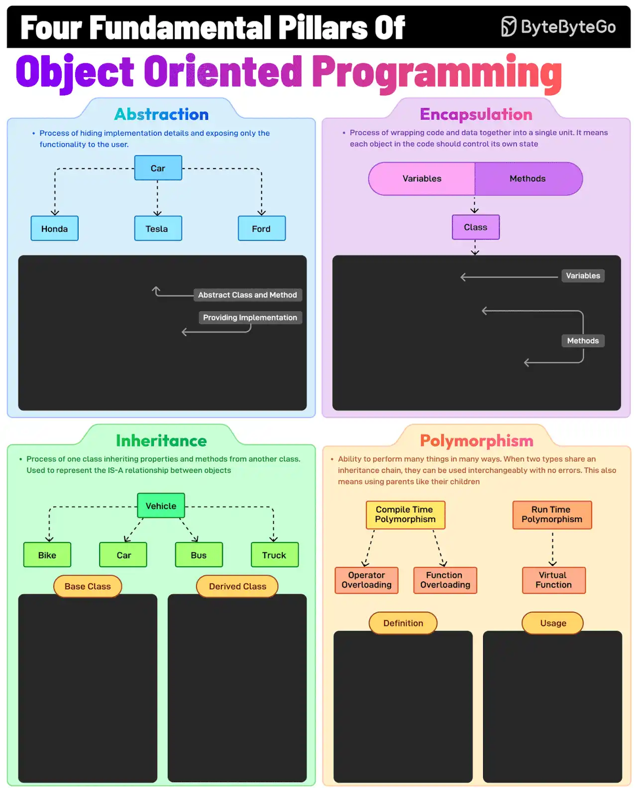

# The Fundamental Pillars of Object-Oriented Programming

## Introduction

The four pillars of object-oriented programming are:

- [Encapsulation](#encapsulation)
- [Abstraction](#abstraction)
- [Inheritance](#inheritance)
- [Polymorphism](#polymorphism)

## Object-Oriented Programming (OOP)

### Encapsulation

It involves wrapping data (fields) and methods in a single unit (class) and restricting direct access using access
modifiers. For example, private fields with public getters and setters.

### Abstraction

This is the process of hiding implementation details and showing only the essential features of an object. For example,
a Vehicle class with an abstract stop method.

### Inheritance

The process of creating a new class (child) that inherits attributes and methods from an existing class (parent),
thereby promoting code reuse. For example, a Car class inherits from a Vehicle class.

### Polymorphism

It allows methods to perform differently based on the object they are invoked on. When two types share an inheritance
chain, they can be used interchangeably with no errors.

## Examples

## Reference

[The Fundamental Pillars of Object-Oriented Programming](https://blog.bytebytego.com/i/153098029/the-fundamental-pillars-of-object-oriented-programming)
